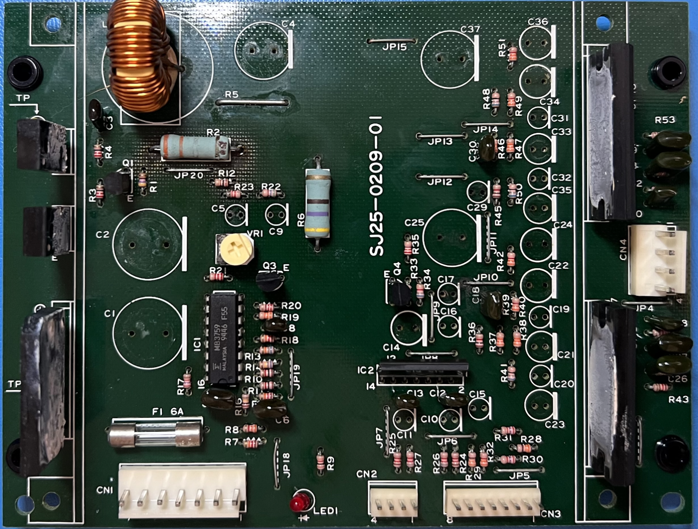

# SJ25-0209-01 / 838-10785-01

| Capacitor  | Diameter | Qty | Location                         |
| ---------- | -------- | --- | -------------------------------- |
| 3.3µF 50V  | 5.00mm   | 7   | C9, C10, C11, C17, C20, C29, C32 |
| 47µF 25V   | 5.00mm   | 5   | C5, C15, C16, C19, C31           |
| 100µF 25V  | 6.30mm   | 4   | C21, C23, C33, C35               |
| 220µF 16V  | 8.00mm   | 1   | C14                              |
| 220µF 25V  | 8.00mm   | 4   | C22, C24, C34, C36               |
| 2200µF 16V | 12.50mm  | 3   | C4, C25, C37                     |
| 2200µF 35V | 16.00mm  | 2   | C1, C2                           |
